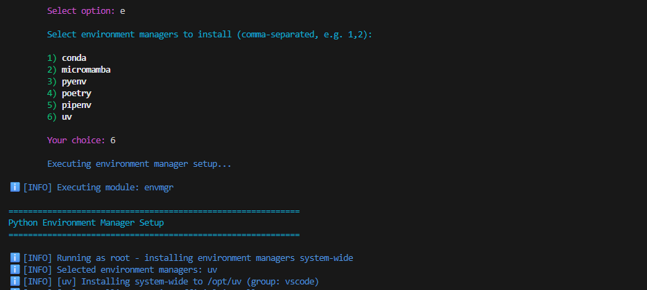

# ml-dev-bootstrap

[](https://github.com/Wchoi189/ml-dev-bootstrap/releases)

A modular setup utility for bootstrapping a development environment on a fresh Ubuntu system. It configures everything from system tools and users to conda, git, and shell prompts with seamless user switching and permission management.

## Key Features

-   ✅ **Modular Architecture**: Run the whole setup or pick just the components you need.
-   ✅ **Smart User Management**: Creates development users with proper permissions and seamless switching.
-   ✅ **APT Sources Configuration**: Configure regional mirrors for faster package downloads.
-   ✅ **Multi-User Environment Managers**: Installs Poetry, Pyenv (default), and Pipenv with proper group permissions.
-   ✅ **Flexible Permission System**: `/opt`-based setup with multiple access points for different user contexts.
-   ✅ **Interactive Menu**: User-friendly menu with comprehensive user management.
-   ✅ **Dry-run Mode**: Preview all changes before they are made.
-   ✅ **Comprehensive Logging**: Structured logging with configurable levels.
-   ✅ **Context-Aware Installation**: Adapts behavior based on root vs user execution context.
-   ✅ **Interactive Locale Selection**: Choose between English and Korean system locales.

## What's New in v0.4.0

### 🚀 **Major Improvements**

- **66% Code Reduction**: Main script refactored from 1107 to 377 lines with modular architecture
- **Smart Context Detection**: Environment managers adapt behavior based on root vs user execution
- **Unified User Management**: Single comprehensive workflow for user creation and switching
- **Interactive Locale Selection**: Choose between English and Korean system locales
- **Enhanced Menu System**: Streamlined quick actions with better organization

### 🎯 **Key Features**

- **Pyenv as Default**: Environment manager module now clearly indicates Pyenv as the default choice
- **Root User Support**: Prompt configuration works correctly for both root and regular users
- **Flexible User Creation**: Interactive prompts for username and password with smart defaults
- **Build Tools Always Included**: `build-essential` package now installed by default
- **Comprehensive Configuration**: New options for controlling all enhanced features

### 📋 **Menu Options Overview**

| Option | Description | Enhancement |
|--------|-------------|-------------|
| `a` | Run all modules | Skips envmgr by default |
| `s` | Configure APT sources | Moved from main flow |
| `r` | User management | **New unified workflow** |
| `e` | Environment managers | **Pyenv default, context-aware** |
| `c` | Show configuration | Enhanced display |
| `q` | Quit | - |

## Quick Start

```bash
# Clone the repository
git clone https://github.com/Wchoi189/ml-dev-bootstrap.git
cd ml-dev-bootstrap

# Make the script executable
chmod +x setup.sh

# Run the complete setup using the interactive menu
sudo ./setup.sh --menu
```

## Enhanced Workflow

### Step 1: System Setup (as root)
```bash
sudo ./setup.sh --all
```

### Step 2: User Management
```bash
# Use the interactive menu option "r) User management (create/switch)"
# Or create user directly: sudo ./setup.sh --menu
```

### Step 3: Continue as User
```bash
cd ~/setup
./setup.sh --menu  # User-specific configurations
```

## Access Points

The setup is accessible from multiple locations for different contexts:

- **System Admin**: `/root/ml-dev-bootstrap` (symlink)
- **Development User**: `~/setup` (symlink)
- **Direct Access**: `/opt/ml-dev-bootstrap` (main location)`

## Screenshots

### Interactive Menu


*The main menu lets you run all modules or pick specific components interactively.*

---

### User Management System


*Option r: Comprehensive user management with create/switch capabilities and interactive prompts.*

---

### APT Sources Configuration


*Configure APT sources to use regional mirrors (Kakao, Naver, Daum, etc.) for faster downloads.*

---

### Environment Manager Selection



*Option e: Choose which Python environment managers to install, with Pyenv as the default option.*

---

### Poetry System Install Output


*Poetry is installed system-wide with dev-group permissions and a global shim.*

---

### User and Group Creation


*Preview of the user and group creation menu (Option 3).*

---

### User and Group Creation(cont'd)


*Selecting an additional user for group membership (Option 3, continued).* 

---

### User and Group Creation(cont'd)


*Selecting a third user for group membership (Option 3, continued).* 

---

### Color Shell Prompt Installation


*Menu for installing a color shell prompt (Option 5).* 

---

### PATH Diagnostics


---

## Usage

You can run the entire suite of modules or select specific ones.
> For more advanced options, module details, and configuration, please see the full [**Usage Guide**](USAGE.md).

```bash
# Run all modules with a progress bar
sudo ./setup.sh --all --progress

# Run only the system and user setup
sudo ./setup.sh system user

# See a list of all available modules
./setup.sh --list

# Run a dry-run to see what would happen
sudo ./setup.sh --all --dry-run

# Interactive menu with enhanced user management
sudo ./setup.sh --menu
```

### Menu Options

- **a)** Run all modules (skips envmgr by default)
- **s)** Configure APT sources (regional mirrors)
- **r)** User management (create/switch) - *New comprehensive user workflow*
- **e)** Run environment manager(s) (Pyenv default, multi-select)
- **c)** Show configuration
- **q)** Quit

### Environment managers (Poetry, Pyenv, Pipenv)

Use the menu option "e) Run environment manager(s)" to select which to install. The env manager module installs tools in a way that members of the dev group can use them across accounts.

- **Pyenv** (Default): Installs per target user, then sets dev-group permissions and creates `/usr/local/bin/pyenv` to expose it.
- Poetry installs system-wide by default to `/opt/pypoetry` with a global shim at `/usr/local/bin/poetry`. If the official installer fails, a venv fallback is used under `/opt/pypoetry/venv`.
- Pipenv installs per target user with dev-group permissions and an optional global shim at `/usr/local/bin/pipenv`.

The module also drops `/etc/profile.d/ml-dev-tools.sh` to ensure common paths (including `/usr/local/bin`, `/opt/pypoetry/bin`, and `$HOME/.local/bin`) are on PATH across new shells.

## Configuration

The main configuration is located in `config/defaults.conf`. You can edit this file directly or override its values by setting environment variables before running the script.

```bash
export GIT_USER_NAME="Your Name"
export GIT_USER_EMAIL="your.email@example.com"
sudo -E ./setup.sh git
```

### Environment Manager Configuration

```bash
# Pyenv (Default environment manager)
INSTALL_PYENV=yes
PYENV_PYTHON_VERSION="3.10.18"  # or comma-separated via PYENV_PYTHON_VERSIONS

# Poetry
INSTALL_POETRY=yes
POETRY_INSTALL_MODE=system   # system|user (default: system)
POETRY_HOME=/opt/pypoetry    # effective when system mode is used

# Pipenv
INSTALL_PIPENV=no

# Environment manager context behavior
ENVMGR_CONTEXT_MODE=auto     # auto|root-only|user-only|always
```

### User Management Configuration

```bash
# User creation settings
USERNAME=dev-user
USER_GROUP=dev
USER_UID=1000
USER_GID=1000
USER_CREATION_MODE=quick-action  # main|quick-action|skip

# Interactive locale selection
INTERACTIVE_LOCALE_SELECTION=no  # yes|no
DEFAULT_LOCALE="en_US.UTF-8"
ADDITIONAL_LOCALES="ko_KR.UTF-8"
```

### System Configuration

```bash
# Installation profile
GLOBAL_INSTALL_PROFILE=full    # minimal|standard|full

# Logging
LOG_LEVEL=INFO
LOG_FILE="/tmp/setup-utility.log"
```

## Advanced Configuration Options

### New in v0.4.0

```bash
# User Management
USER_CREATION_MODE=quick-action     # main|quick-action|skip
INTERACTIVE_LOCALE_SELECTION=no     # yes|no for locale prompts

# Environment Manager Context
ENVMGR_CONTEXT_MODE=auto            # auto|root-only|user-only|always

# Locale Configuration
DEFAULT_LOCALE="en_US.UTF-8"
ADDITIONAL_LOCALES="ko_KR.UTF-8"
```

### Configuration Override Examples

```bash
# Enable interactive locale selection
export INTERACTIVE_LOCALE_SELECTION=yes
sudo -E ./setup.sh --menu

# Force user-only environment manager installation
export ENVMGR_CONTEXT_MODE=user-only
sudo -E ./setup.sh envmgr

# Skip user creation entirely
export USER_CREATION_MODE=skip
sudo -E ./setup.sh --all
```

Tip: If `poetry` is not found immediately in your current shell, refresh your PATH cache or start a login shell:

```bash
hash -r
exec $SHELL -l
poetry --version
```

## Setting a specific password(Optional)
1.  **Enable the password feature** and define your chosen password by exporting two environment variables:
    ```bash
    export SET_USER_PASSWORD=true
    export USER_PASSWORD="your_secure_password_here"
    ```
2.  **Run the setup script** using the `-E` flag to preserve the variables:
    ```bash
    sudo -E ./setup.sh --all
    ```
## Contributing

Contributions are welcome\! Please see the `CONTRIBUTING.md` file for guidelines on how to add new modules and submit changes. This project follows Semantic Versioning.

## License

This project is licensed under the MIT License.

---

**Version 0.4.0** - Enhanced with modular architecture, unified user management, and context-aware installations.