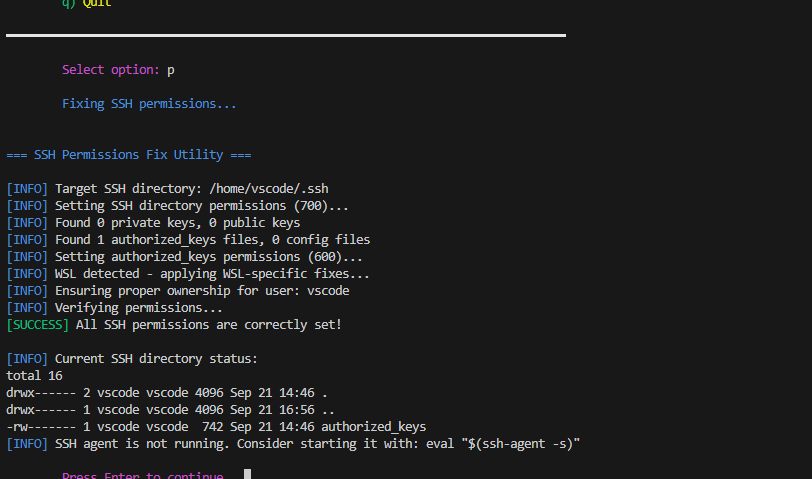

# ml-dev-bootstrap

[](https://github.com/Wchoi189/ml-dev-bootstrap/releases)
[](https://github.com/Wchoi189/ml-dev-bootstrap/actions/workflows/ci.yml)

새로운 Ubuntu 시스템에서 개발 환경을 부트스트랩하기 위한 모듈형 설정 유틸리티입니다. 시스템 도구와 사용자부터 conda, git, 셸 프롬프트까지 원활한 사용자 전환 및 권한 관리와 함께 모든 것을 구성합니다.

## 주요 기능

-   ✅ **모듈형 아키텍처**: 전체 설정을 실행하거나 필요한 구성 요소만 선택할 수 있습니다.
-   ✅ **스마트 사용자 관리**: 적절한 권한과 원활한 전환으로 개발 사용자를 생성합니다.
-   ✅ **APT 소스 구성**: 더 빠른 패키지 다운로드를 위한 지역 미러를 구성합니다.
-   ✅ **다중 사용자 환경 관리자**: 적절한 그룹 권한으로 UV(기본값), Poetry, Pyenv, Pipenv를 설치합니다.
-   ✅ **유연한 권한 시스템**: 다양한 사용자 컨텍스트를 위한 여러 액세스 포인트가 있는 `/opt` 기반 설정.
-   ✅ **대화형 메뉴**: 포괄적인 사용자 관리가 포함된 사용자 친화적 메뉴.
-   ✅ **드라이런 모드**: 변경 사항이 적용되기 전에 모든 변경 사항을 미리 봅니다.
-   ✅ **포괄적인 로깅**: 구성 가능한 레벨의 구조화된 로깅.
-   ✅ **컨텍스트 인식 설치**: root 대 사용자 실행 컨텍스트에 따라 동작을 조정합니다.
-   ✅ **대화형 로케일 선택**: 영어와 한국어 시스템 로케일 중에서 선택합니다.

## v0.5.0의 새로운 기능

### 🚀 **주요 개선사항**

- **UV 패키지 관리자**: 빠른 설치 및 의존성 해결을 위한 새로운 기본 Python 패키지 관리자로 UV 추가
- **SSH 권한 수정 메뉴**: 대화형 메뉴에서 직접 SSH 권한 복구 유틸리티에 빠르게 액세스
- **향상된 환경 관리자 선택**: 다중 선택 환경 관리자 메뉴에서 옵션 6으로 UV 사용 가능

### 🎯 **주요 기능**

- **기본값으로 UV**: 환경 관리자 모듈이 이제 더 빠른 Python 패키지 관리를 위해 UV를 기본값으로 사용
- **SSH 빠른 수정**: 즉시 SSH 권한 복구를 위한 메뉴 옵션 "p) SSH 권한 수정"
- **확장된 환경 옵션**: 이제 UV, Poetry, Pyenv, Pipenv, Conda, Micromamba 지원
- **업데이트된 문서**: 새로운 UV 통합 및 SSH 수정 기능에 대한 포괄적인 가이드

### 📋 **메뉴 옵션 개요**

| 옵션 | 설명 | 개선사항 |
|--------|-------------|-------------|
| `a` | 모든 모듈 실행 | 기본적으로 `envmgr`와 `SSH`는 건너뜀 |
| `s` | APT 소스 구성 | 메인 플로우에서 이동 |
| `r` | 사용자 관리 | **새로운 통합 워크플로** |
| `e` | 환경 관리자 | **UV 기본값, 컨텍스트 인식** |
| `p` | SSH 권한 수정 | **빠른 권한 복구** |
| `c` | 구성 표시 | 향상된 디스플레이 |
| `q` | 종료 | - |

## 빠른 시작

```bash
# 저장소 복제
git clone https://github.com/Wchoi189/ml-dev-bootstrap.git
cd ml-dev-bootstrap

# 스크립트를 실행 가능하게 만들기
chmod +x setup.sh

# 대화형 메뉴를 사용하여 완전한 설정 실행
sudo ./setup.sh --menu
```

## 향상된 워크플로

### 1단계: 시스템 설정 (root로)
```bash
sudo ./setup.sh --all
```

### 2단계: 사용자 관리
```bash
# 대화형 메뉴 옵션 "r) 사용자 관리 (생성/전환)" 사용
# 또는 사용자 직접 생성: sudo ./setup.sh --menu
```

### 3단계: 사용자로 계속
```bash
cd ~/setup
./setup.sh --menu  # 사용자별 구성
```

## 액세스 포인트

설정은 다양한 컨텍스트를 위해 여러 위치에서 액세스할 수 있습니다:

- **시스템 관리자**: `/root/ml-dev-bootstrap` (심볼릭 링크)
- **개발 사용자**: `~/setup` (심볼릭 링크)
- **직접 액세스**: `/opt/ml-dev-bootstrap` (메인 위치)

## 스크린샷

### 대화형 메뉴


*메인 메뉴를 통해 모든 모듈을 실행하거나 특정 구성 요소를 대화형으로 선택할 수 있습니다.*

---

### 사용자 관리 시스템


*옵션 r: 생성/전환 기능과 대화형 프롬프트가 있는 포괄적인 사용자 관리.*

---

### APT 소스 구성


*더 빠른 다운로드를 위해 지역 미러(Kakao, Naver, Daum 등)를 사용하도록 APT 소스를 구성합니다.*

---

### 환경 관리자 선택


*옵션 e: UV를 기본 옵션으로 하여 설치할 Python 환경 관리자를 선택합니다.*

---

### Poetry 시스템 설치 출력


*Poetry는 dev-group 권한과 글로벌 shim으로 시스템 전체에 설치됩니다.*

---

### 사용자 및 그룹 생성


*사용자 및 그룹 생성 메뉴 미리보기 (옵션 3).*

---

### 사용자 및 그룹 생성(계속)


*그룹 멤버십을 위한 추가 사용자 선택 (옵션 3, 계속).*

---

### 사용자 및 그룹 생성(계속)


*그룹 멤버십을 위한 세 번째 사용자 선택 (옵션 3, 계속).*

---

### 컬러 셸 프롬프트 설치


*컬러 셸 프롬프트 설치 메뉴 (옵션 5).*

---

### PATH 진단


---

## 사용법

전체 모듈 세트를 실행하거나 특정 모듈을 선택할 수 있습니다.
> 고급 옵션, 모듈 세부사항 및 구성에 대해서는 전체 [**사용 가이드**](USAGE.md)를 참조하세요.

```bash
# 진행률 표시줄과 함께 모든 모듈 실행
sudo ./setup.sh --all --progress

# 시스템 및 사용자 설정만 실행
sudo ./setup.sh system user

# 사용 가능한 모든 모듈 목록 보기
./setup.sh --list

# 무엇이 일어날지 보기 위한 드라이런 실행
sudo ./setup.sh --all --dry-run

# 향상된 사용자 관리가 있는 대화형 메뉴
sudo ./setup.sh --menu
```

### 메뉴 옵션

- **a)** 모든 모듈 실행 (기본적으로 envmgr와 SSH는 건너뜀)
- **s)** APT 소스 구성 (지역 미러)
- **r)** 사용자 관리 (생성/전환) - *새로운 포괄적인 사용자 워크플로*
- **e)** 환경 관리자 실행 (UV 기본값, 다중 선택)
- **p)** SSH 권한 수정 - *빠른 SSH 권한 복구*
- **c)** 구성 표시
- **q)** 종료

### 환경 관리자 (UV, Poetry, Pyenv, Pipenv)

메뉴 옵션 "e) 환경 관리자 실행"을 사용하여 설치할 것을 선택하세요. env manager 모듈은 dev 그룹의 구성원이 계정 간에 사용할 수 있는 방식으로 도구를 설치합니다.

- **UV** (기본값): 빠른 Python 패키지 설치 프로그램 및 해결사, dev-group 권한으로 대상 사용자별로 설치하고 `/usr/local/bin/uv`를 생성하여 노출합니다.
- **Pyenv**: 대상 사용자별로 설치한 다음 dev-group 권한을 설정하고 `/usr/local/bin/pyenv`를 생성하여 노출합니다.
- Poetry는 기본적으로 `/opt/pypoetry`에 시스템 전체에 설치되며 `/usr/local/bin/poetry`에 글로벌 shim이 있습니다. 공식 설치 프로그램이 실패하면 `/opt/pypoetry/venv` 아래에 venv 폴백이 사용됩니다.
- Pipenv는 dev-group 권한으로 대상 사용자별로 설치되며 `/usr/local/bin/pipenv`에 선택적 글로벌 shim이 있습니다.

이 모듈은 또한 `/etc/profile.d/ml-dev-tools.sh`를 배치하여 새로운 셸에서 공통 경로(`/usr/local/bin`, `/opt/pypoetry/bin`, `$HOME/.local/bin` 포함)가 PATH에 있도록 보장합니다.

### SSH 권한 수정

메뉴 옵션 "p) SSH 권한 수정"은 일반적인 SSH 권한 문제를 자동으로 수정하는 SSH 권한 수정 유틸리티에 빠르게 액세스할 수 있습니다:

- **SSH 디렉토리 권한** (700)
- **개인 키 권한** (600)
- **공개 키 권한** (644)
- **authorized_keys 권한** (600)
- **SSH config 권한** (600)
- **known_hosts 권한** (644)

이는 권한 불일치로 인해 SSH 연결이 방해받을 수 있는 컨테이너에 연결하는 WSL 사용자에게 특히 유용합니다. 유틸리티는 기본 `~/.ssh` 디렉토리 또는 사용자 정의 SSH 디렉토리의 권한을 수정할 수 있습니다.


*SSH 권한 수정 메뉴 옵션*


*SSH 권한 수정 실행 중*

## 구성

메인 구성은 `config/defaults.conf`에 있습니다. 이 파일을 직접 편집하거나 스크립트를 실행하기 전에 환경 변수를 설정 하여 값을 재정의할 수 있습니다.

```bash
export GIT_USER_NAME="Your Name"
export GIT_USER_EMAIL="your.email@example.com"
sudo -E ./setup.sh git
```

### 환경 관리자 구성

```bash
# UV (기본 환경 관리자)
INSTALL_UV=yes

# Pyenv (대체 환경 관리자)
INSTALL_PYENV=no
PYENV_PYTHON_VERSION="3.10.18"  # 또는 PYENV_PYTHON_VERSIONS를 통해 쉼표로 구분

# Poetry
INSTALL_POETRY=no
POETRY_INSTALL_MODE=system   # system|user (기본값: system)
POETRY_HOME=/opt/pypoetry    # system 모드 사용 시 유효

# Pipenv
INSTALL_PIPENV=no

# 환경 관리자 컨텍스트 동작
ENVMGR_CONTEXT_MODE=auto     # auto|root-only|user-only|always
```

### 사용자 관리 구성

```bash
# 사용자 생성 설정
USERNAME=vscode
USER_GROUP=vscode
USER_UID=1000
USER_GID=1000
USER_CREATION_MODE=quick-action  # main|quick-action|skip

# 대화형 로케일 선택
INTERACTIVE_LOCALE_SELECTION=no  # yes|no
DEFAULT_LOCALE="en_US.UTF-8"
ADDITIONAL_LOCALES="ko_KR.UTF-8"
```

### 시스템 구성

```bash
# 설치 프로필
GLOBAL_INSTALL_PROFILE=full    # minimal|standard|full

# 로깅
LOG_LEVEL=INFO
LOG_FILE="./setup-utility.log"
# Alternative locations:
# LOG_FILE="$HOME/setup-utility.log"     # User home directory
# LOG_FILE="./logs/setup-utility.log"    # Project logs directory
# LOG_FILE="/var/log/setup-utility.log"  # System logs (requires root)
```

## 고급 구성 옵션

### v0.4.0의 새로운 기능

```bash
# 사용자 관리
USER_CREATION_MODE=quick-action     # main|quick-action|skip
INTERACTIVE_LOCALE_SELECTION=no     # 로케일 프롬프트를 위한 yes|no

# 환경 관리자 컨텍스트
ENVMGR_CONTEXT_MODE=auto            # auto|root-only|user-only|always

# 로케일 구성
DEFAULT_LOCALE="en_US.UTF-8"
ADDITIONAL_LOCALES="ko_KR.UTF-8"
```

### 구성 재정의 예시

```bash
# 대화형 로케일 선택 활성화
export INTERACTIVE_LOCALE_SELECTION=yes
sudo -E ./setup.sh --menu

# 사용자 전용 환경 관리자 설치 강제
export ENVMGR_CONTEXT_MODE=user-only
sudo -E ./setup.sh envmgr

# 사용자 생성 완전히 건너뛰기
export USER_CREATION_MODE=skip
sudo -E ./setup.sh --all
```

팁: 현재 셸에서 `poetry`를 즉시 찾을 수 없는 경우, PATH 캐시를 새로 고치거나 로그인 셸을 시작하세요:

```bash
hash -r
exec $SHELL -l
poetry --version
```

## 특정 비밀번호 설정(선택사항)
1.  **비밀번호 기능을 활성화**하고 두 개의 환경 변수를 내보내어 선택한 비밀번호를 정의합니다:
    ```bash
    export SET_USER_PASSWORD=true
    export USER_PASSWORD="your_secure_password_here"
    ```
2.  **변수를 보존하기 위해 `-E` 플래그를 사용하여 설정 스크립트를 실행**합니다:
    ```bash
    sudo -E ./setup.sh --all
    ```

## 기여하기

기여를 환영합니다! 새로운 모듈을 추가하고 변경 사항을 제출하는 방법에 대한 지침은 `CONTRIBUTING.md` 파일을 참조하세요. 이 프로젝트는 시맨틱 버전 관리를 따릅니다.

## 라이선스

이 프로젝트는 MIT 라이선스에 따라 라이선스가 부여됩니다.

---
