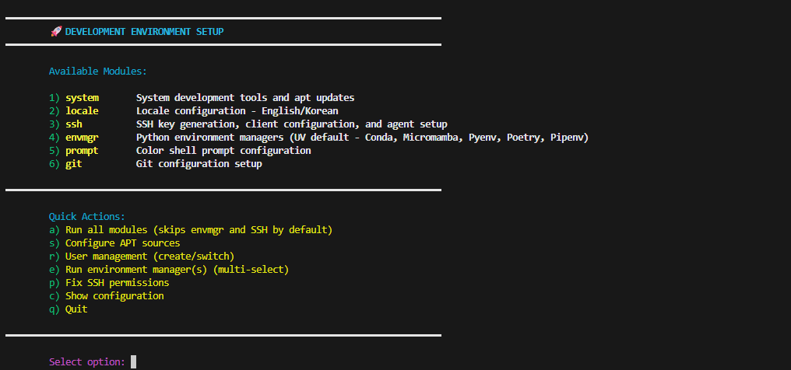
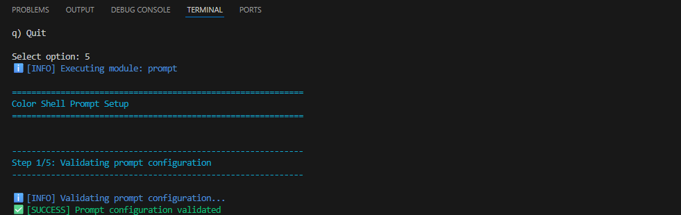
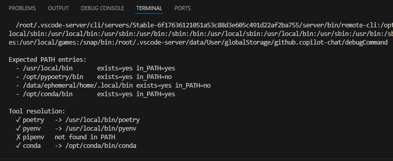

# ML Dev Bootstrap

[](https://github.com/Wchoi189/ml-dev-bootstrap/actions/workflows/ci.yml)
[](https://github.com/Wchoi189/ml-dev-bootstrap/releases)
[](https://opensource.org/licenses/MIT)
[](https://your-docs-link)

Ubuntu 시스템을 위한 모듈형 개발 환경 부트스트랩 유틸리티입니다. 개발 도구, 사용자 관리, 패키지 관리자, 셸 구성을 적절한 권한과 원활한 사용자 전환으로 간소화합니다.

## 목차

- [개요](#개요)
- [주요 기능](#주요-기능)
- [v0.5.0의 새로운 기능](#v050의-새로운-기능)
  - [🚀 주요 개선사항](#-주요-개선사항)
  - [📋 업데이트된 메뉴 옵션](#-업데이트된-메뉴-옵션)
- [빠른 시작](#빠른-시작)
- [권장 워크플로](#권장-워크플로)
- [사용 예시](#사용-예시)
- [환경 관리자](#환경-관리자)
- [SSH 권한 복구](#ssh-권한-복구)
- [구성](#구성)
- [고급 구성 옵션](#고급-구성-옵션)
- [스크린샷](#스크린샷)
- [문제 해결](#문제-해결)


## 파일 위치


```
ml-dev-bootstrap/
├── README.md
├── setup.sh
├── config/
│   └── defaults.conf
├── docs/
│   └── screenshots/
├── modules/
└── ...
```

## 개요

ML Dev Bootstrap은 새로운 리눅스 기반 도커 개발환경 설정할 때 해야 하는 시스템 소프트웨 업데이트, 지역에 적합한 소스 리스트 설정, 개발환경 라이버리, 새로운 사용자 생성와 전환, 칼라 쉘 프롬트, 깃허브 설정, 파이썬, 패키지 매니저와 심지어 SSH 설정까지 이 복잡하고 오래 걸리고 번거로운 작업을 손 쉽게 할 수 있도록 합니다.


## 주요 기능

### 🏗️ **아키텍처**
- **모듈형 설계**: 전체 설정 실행 또는 특정 구성 요소 선택 가능
- **다중 액세스 포인트**: `/root`, `~/setup`, `/opt/ml-dev-bootstrap`에서 접근 가능
- **컨텍스트 인식**: root 대 사용자 실행 컨텍스트에 따라 동작 조정

### 👥 **사용자 관리**
- **스마트 사용자 생성**: 적절한 권한으로 개발 사용자 생성
- **원활한 전환**: 환경을 유지하면서 사용자 간 전환
- **그룹 기반 권한**: `dev` 그룹 멤버십을 통한 액세스 관리

### 🛠️ **개발 도구**
- **Python 환경 관리자**: UV 및 Pyenv(기본값), Poetry, Pipenv, Conda, Micromamba
- **패키지 관리**: 지역 미러를 사용한 APT 소스 구성
- **셸 향상**: 컬러 프롬프트 및 PATH 관리
- **GitHub CLI 통합**: gh 설치, 자동 토큰 감지, 메뉴 기반 인증 지원

### 🔧 **시스템 관리**
- **SSH 권한 복구**: 일반적인 SSH 권한 문제 빠른 수정
- **로케일 구성**: 대화형 한국어/영어 로케일 선택
- **포괄적인 로깅**: 구성 가능한 레벨의 구조화된 로깅
- **드라이런 모드**: 실행 전 변경 사항 미리보기

## v0.5.0의 새로운 기능

### 🚀 **주요 개선사항**
- **UV 패키지 관리자**: 빠른 설치 및 의존성 해결을 위한 새로운 기본 Python 패키지 관리자
- **SSH 권한 복구**: 대화형 메뉴에서 SSH 권한 복구 유틸리티에 직접 액세스
- **향상된 환경 관리자 선택**: 다중 선택 환경 관리자 메뉴에서 UV를 옵션 6으로 제공

### 📋 **업데이트된 메뉴 옵션**

| 옵션 | 설명 | 개선사항 |
|------|------|----------|
| `a` | 모든 모듈 실행 | 기본적으로 `envmgr`와 `SSH` 건너뜀 |
| `s` | APT 소스 구성 | 메인 플로우에서 분리 |
| `r` | 사용자 관리 | **새로운 통합 워크플로** |
| `e` | 환경 관리자 | **UV 및 Pyenv 기본값, 컨텍스트 인식** |
| `p` | SSH 권한 수정 | **빠른 권한 복구** |
| `g` | GitHub CLI 설정 | **gh 설치 및 토큰 기반 인증 빠른 실행** |
| `c` | 구성 표시 | 향상된 디스플레이 |
| `q` | 종료 | - |

## 빠른 시작

```bash
# 저장소 복제
git clone https://github.com/Wchoi189/ml-dev-bootstrap.git
cd ml-dev-bootstrap

# 스크립트 실행 권한 부여
chmod +x setup.sh

# 대화형 메뉴로 완전한 설정 실행
sudo ./setup.sh --menu
```

## 권장 워크플로

### 1단계: 시스템 설정 (root로 실행)
```bash
sudo ./setup.sh --all
```

### 2단계: 사용자 관리
```bash
# 대화형 메뉴 옵션 "r) 사용자 관리" 사용
sudo ./setup.sh --menu
```

### 3단계: 사용자로 계속 진행
```bash
cd ~/setup
./setup.sh --menu  # 사용자별 구성
```

## 사용 예시

```bash
# 진행률 표시줄과 함께 모든 모듈 실행
sudo ./setup.sh --all --progress

# 특정 모듈만 실행
sudo ./setup.sh system user

# 사용 가능한 모듈 목록 보기
./setup.sh --list

# 실행 없이 변경 사항 미리보기
sudo ./setup.sh --all --dry-run

# 향상된 사용자 관리가 포함된 대화형 메뉴
sudo ./setup.sh --menu
```

## 환경 관리자

환경 관리자 모듈은 여러 Python 패키지 및 환경 관리 도구를 지원합니다:

### UV 및 Pyenv (기본값)
- 빠른 Python 패키지 설치 프로그램 및 해결사
- dev-group 권한으로 대상 사용자별 설치
- `/usr/local/bin/uv`를 통한 전역 액세스

### Poetry
- 기본적으로 `/opt/pypoetry`에 시스템 전체 설치
- `/usr/local/bin/poetry`에 전역 shim
- 공식 설치 프로그램 실패 시 venv 설치로 폴백

### Pyenv
- dev-group 권한으로 사용자별 설치
- `/usr/local/bin/pyenv`를 통한 전역 액세스
- 구성 가능한 Python 버전

### Pipenv
- dev-group 권한으로 사용자별 설치
- `/usr/local/bin/pipenv`에 선택적 전역 shim

## SSH 권한 복구

SSH 권한 복구 유틸리티(메뉴 옵션 `p`)는 일반적인 SSH 권한 문제를 자동으로 수정합니다:

- SSH 디렉토리 권한 (700)
- 개인 키 권한 (600)
- 공개 키 권한 (644)
- authorized_keys 권한 (600)
- SSH config 권한 (600)
- known_hosts 권한 (644)

권한 불일치로 인해 SSH 연결이 방해받을 수 있는 컨테이너에 연결하는 WSL 사용자에게 특히 유용합니다.

## 구성

### 기본 구성

메인 구성은 `config/defaults.conf`에 위치합니다. 이 파일을 직접 편집하거나 스크립트 실행 전에 환경 변수를 설정하여 값을 재정의할 수 있습니다.

```bash
export GIT_USER_NAME="Your Name"
export GIT_USER_EMAIL="your.email@example.com"
sudo -E ./setup.sh git
```

### 환경 관리자 구성

```bash
# UV 및 Pyenv (기본 환경 관리자)
INSTALL_UV=yes
INSTALL_PYENV=yes
PYENV_PYTHON_VERSION="3.10.18"  # 또는 PYENV_PYTHON_VERSIONS로 쉼표 구분

# Poetry
INSTALL_POETRY=no
POETRY_INSTALL_MODE=system   # system|user (기본값: system)
POETRY_HOME=/opt/pypoetry    # system 모드 사용 시

# Pipenv
INSTALL_PIPENV=no

# 환경 관리자 컨텍스트 동작
ENVMGR_CONTEXT_MODE=auto     # auto|root-only|user-only|always
```

### 사용자 관리 구성

```bash
# 사용자 생성 설정
USERNAME=vscode
USER_GROUP=vscode
USER_UID=1000
USER_GID=1000
USER_CREATION_MODE=quick-action  # main|quick-action|skip

# 대화형 로케일 선택
INTERACTIVE_LOCALE_SELECTION=no  # yes|no
DEFAULT_LOCALE="ko_KR.UTF-8"
ADDITIONAL_LOCALES="en_US.UTF-8"
```

### 시스템 구성

```bash
# 설치 프로필
GLOBAL_INSTALL_PROFILE=full    # minimal|standard|full

# 로깅
LOG_LEVEL=INFO
LOG_FILE="./setup-utility.log"
# 대체 위치:
# LOG_FILE="$HOME/setup-utility.log"     # 사용자 홈 디렉토리
# LOG_FILE="./logs/setup-utility.log"    # 프로젝트 로그 디렉토리
# LOG_FILE="/var/log/setup-utility.log"  # 시스템 로그 (root 권한 필요)
```

## 고급 구성 옵션

### 구성 재정의 예시

```bash
# 대화형 로케일 선택 활성화
export INTERACTIVE_LOCALE_SELECTION=yes
sudo -E ./setup.sh --menu

# 사용자 전용 환경 관리자 설치 강제
export ENVMGR_CONTEXT_MODE=user-only
sudo -E ./setup.sh envmgr

# 사용자 생성 완전히 건너뛰기
export USER_CREATION_MODE=skip
sudo -E ./setup.sh --all
```

### 특정 비밀번호 설정 (선택사항)

```bash
# 비밀번호 기능 활성화 및 환경 변수 설정
export SET_USER_PASSWORD=true
export USER_PASSWORD="your_secure_password_here"

# 변수 보존을 위해 -E 플래그 사용
sudo -E ./setup.sh --all
```

## 스크린샷

### 대화형 메뉴



*메인 메뉴를 통해 모든 모듈을 실행하거나 특정 구성 요소를 대화형으로 선택할 수 있습니다.*

---

### 사용자 관리 시스템


*옵션 r: 생성/전환 기능과 대화형 프롬프트가 있는 포괄적인 사용자 관리.*

---

### APT 소스 구성


*더 빠른 다운로드를 위해 지역 미러(Kakao, Naver, Daum 등)를 사용하도록 APT 소스를 구성합니다.*

---

### 환경 관리자 선택


*옵션 e: UV 및 Pyenv를 기본 옵션으로 하여 설치할 Python 환경 관리자를 선택합니다.*

---

### Poetry 시스템 설치 출력


*Poetry는 dev-group 권한과 글로벌 shim으로 시스템 전체에 설치됩니다.*

---

### 사용자 및 그룹 생성


*사용자 및 그룹 생성 메뉴 미리보기 (옵션 3).*

---

### 사용자 및 그룹 생성(계속)


*그룹 멤버십을 위한 추가 사용자 선택 (옵션 3, 계속).*

---

### 사용자 및 그룹 생성(계속)


*그룹 멤버십을 위한 세 번째 사용자 선택 (옵션 3, 계속).*

---

### 컬러 셸 프롬프트 설치



*컬러 셸 프롬프트 설치 메뉴 (옵션 5).*

---

### PATH 진단





*포괄적인 PATH 진단 출력*
---


## 문제 해결

### 일반적인 문제

**Poetry를 찾을 수 없는 경우:**
```bash
# PATH 캐시 새로고침 또는 로그인 셸 시작
hash -r
exec $SHELL -l
poetry --version
```

**권한 문제:**
```bash
# SSH 권한 빠른 수정
sudo ./setup.sh --menu
# 메뉴에서 'p' 선택
```

**환경 변수가 적용되지 않는 경우:**
```bash
# -E 플래그로 환경 변수 보존
sudo -E ./setup.sh --menu
```

## 액세스 포인트

설정은 다양한 컨텍스트를 위해 여러 위치에서 액세스할 수 있습니다:

- **시스템 관리자**: `/root/ml-dev-bootstrap` (심볼릭 링크)
- **개발 사용자**: `~/setup` (심볼릭 링크)
- **직접 액세스**: `/opt/ml-dev-bootstrap` (메인 위치)

## 모듈 개요

| 모듈 | 설명 | 실행 컨텍스트 |
|------|------|---------------|
| `system` | 기본 시스템 패키지 및 도구 | Root |
| `user` | 사용자 생성 및 그룹 관리 | Root |
| `git` | Git 구성 및 설정 | Root/User |
| `shell` | 셸 프롬프트 및 환경 | Root/User |
| `envmgr` | Python 환경 관리자 | Root/User |
| `ssh` | SSH 권한 및 구성 | Root/User |
| `ghcli` | GitHub CLI 설치 및 인증 도우미 | Root/User |

## 지원되는 시스템

- **Ubuntu 18.04 LTS** 이상
- **Debian 10** 이상
- **WSL2** (Windows Subsystem for Linux)
- **Docker 컨테이너** (Ubuntu 기반)

## 기여하기

기여를 환영합니다! 다음 단계를 따라주세요:

1. 저장소를 포크합니다
2. 기능 브랜치를 생성합니다 (`git checkout -b feature/amazing-feature`)
3. 변경 사항을 커밋합니다 (`git commit -m 'Add amazing feature'`)
4. 브랜치에 푸시합니다 (`git push origin feature/amazing-feature`)
5. Pull Request를 생성합니다

자세한 지침은 [CONTRIBUTING.md](CONTRIBUTING.md)를 참조하세요.

## 버전 관리

이 프로젝트는 [시맨틱 버전 관리](https://semver.org/)를 따릅니다. 사용 가능한 버전은 [태그](https://github.com/Wchoi189/ml-dev-bootstrap/tags)를 참조하세요.

## 라이선스

이 프로젝트는 MIT 라이선스에 따라 라이선스가 부여됩니다. 자세한 내용은 [LICENSE](LICENSE) 파일을 참조하세요.

## 지원

문제가 발생하거나 질문이 있으시면:

- [Issues](https://github.com/Wchoi189/ml-dev-bootstrap/issues)에서 버그 리포트 또는 기능 요청
- [Discussions](https://github.com/Wchoi189/ml-dev-bootstrap/discussions)에서 일반적인 질문
- 자세한 사용법은 [USAGE.md](USAGE.md) 참조

---
